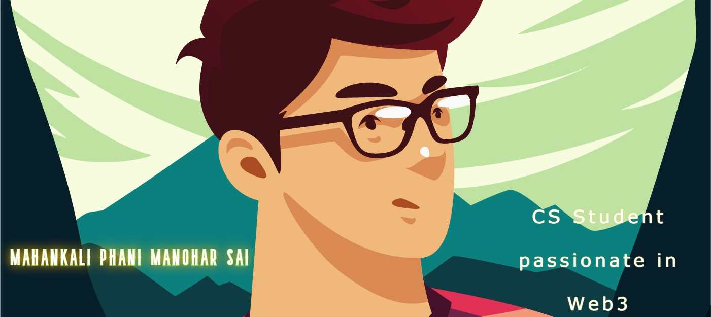

# Hi 👋 !

## I'm Mahankali Phani Manohar Sai

I'm a CS student 
I’m interested in blockchain and web3
I’m currently learning ethereum 
I’m looking to collaborate on dapps
my other github account is @mahankalisec it's about security
you may follow me on GitHub, LinkedIn and Twitter.  

[]

## Technologies which I use:

### Frontend Technologies

  
  
  
  
  
  
  
  
  

 

### Tools

  
  
  
  

  

